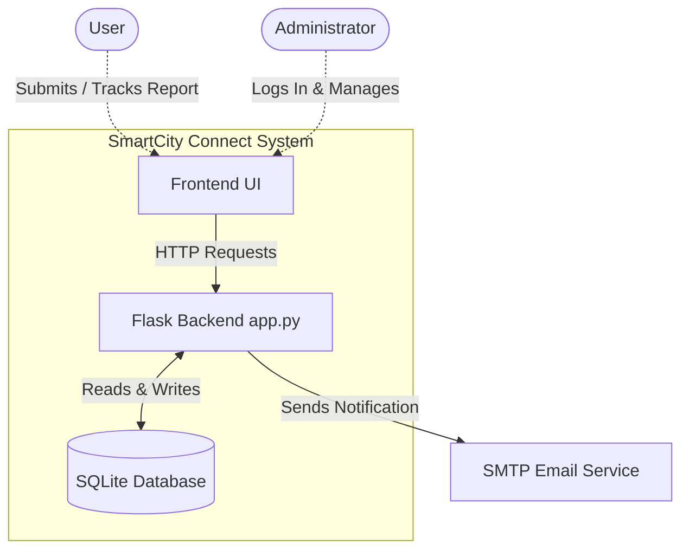

# SmartCity Connect - Problem Reporting System

A web-based platform built with Python (Flask) and SQLite that allows users to report local issues, track their resolution status, and receive real-time email notifications. Administrators can manage all submitted reports through a dedicated dashboard.

## Features
- **Submit Reports**: Users can submit detailed problem reports including description, location, category, and their email address.
- **Track Reports**: Users receive a unique Tracking ID (e.g., `CH-123456`) immediately upon submission to monitor the status of their report.
- **Email Notifications**: Automated email confirmations are sent to users upon successful report submission using an SMTP server.
- **Admin Dashboard**: Secure login for administrators to view, manage, and update the status of existing reports.
- **Analytics & Profiles**: Integrated pages for tracking overall analytics and user profile views.

## Technologies Used
- **Backend Framework**: Python, Flask
- **Database**: SQLite3
- **Frontend**: HTML, CSS, JavaScript (via Flask `render_template`)
- **Email Service**: Built-in `smtplib` and `email.message` via Gmail SMTP

## System Architecture



## Project Structure
```text
final/
│
├── app/                   # Application Package (Application Factory Pattern)
│   ├── __init__.py        # App Initialization & Blueprints Registration
│   ├── models.py          # Flask-SQLAlchemy Database Models
│   ├── routes/            # Modular Routing
│   │   ├── main.py        # Public Pages (Home, Report, Track)
│   │   ├── admin.py       # Admin Interface
│   │   └── api.py         # JSON API Endpoints
│   └── utils/             # Utilities
│       └── email.py       # Extracted SMTP Logic
├── app.py                 # Minimal Entrypoint Script
├── config.py              # Environment Configuration Mapper
├── .env                   # Secrets & Environment Variables (Not in source control)
├── requirements.txt       # Dependency List
├── database.db            # SQLite database file (Auto-generated by SQLAlchemy)
├── static/                # Static assets (CSS, JS, images)
└── templates/             # HTML frontend templates (Styled with Bootstrap 5)
```

## Setup & Installation

### 1. Prerequisites
- **Python 3.x** installed on your system.

### 2. Install Dependencies
Ensure you install the required Python packages (primarily Flask). Run the following command in your terminal:
```bash
pip install Flask
```

### 3. Configure Email Services (SMTP)
The application uses Google's SMTP server (`smtp.gmail.com`) to send tracking IDs. You have two options for setting email credentials:
1. **Environment Variables** (Recommended): Set `SMTP_EMAIL` and `SMTP_PASSWORD` in your system environment variables.
2. **Direct Configuration**: Ensure that a valid Gmail address and an App Password are placed in the `send_email` function inside `app.py`.

*Note: Use a "Google App Password" instead of your regular account password to authenticate securely.*

### 4. Run the Application
Start the Flask development server by running:
```bash
python app.py
```
The application will launch on your local server. Open your web browser and navigate to:
`http://127.0.0.1:5000/`

## Admin Access
To access the admin dashboard, visit `http://127.0.0.1:5000/admin` and use the following default credentials (which can be changed in `app.py`):
- **Username**: `admin`
- **Password**: `admin123`

## Core API Endpoints
- **`POST /submit_report`**: Submits a new report to the database and dispatches an email.
- **`GET /track_report/<id>`**: Fetches the details and progress status of a specific report.
- **`POST /admin-login`**: Authenticates admin user securely.
- **`GET /all_reports`**: Returns a list of all existing reports for the admin dashboard.
- **`POST /update_status`**: Allows the admin to update the resolution status of an active report.
